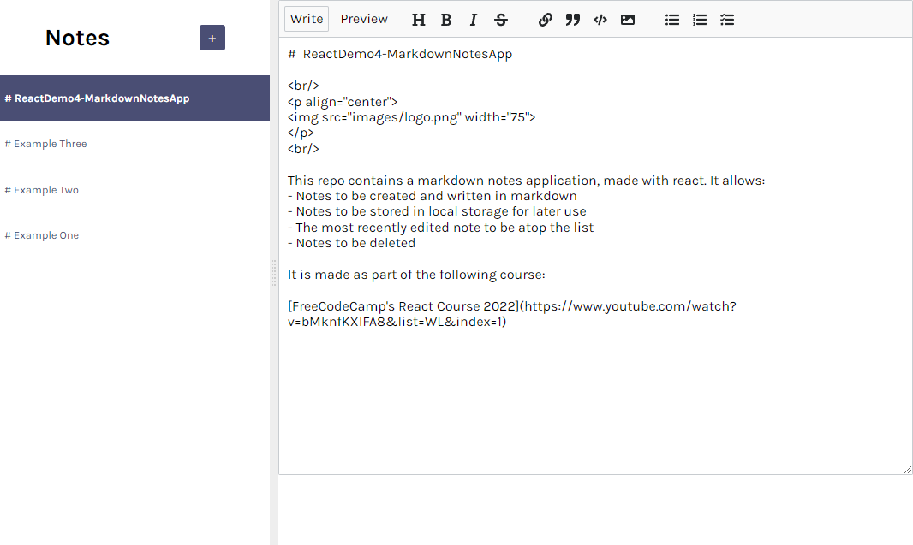
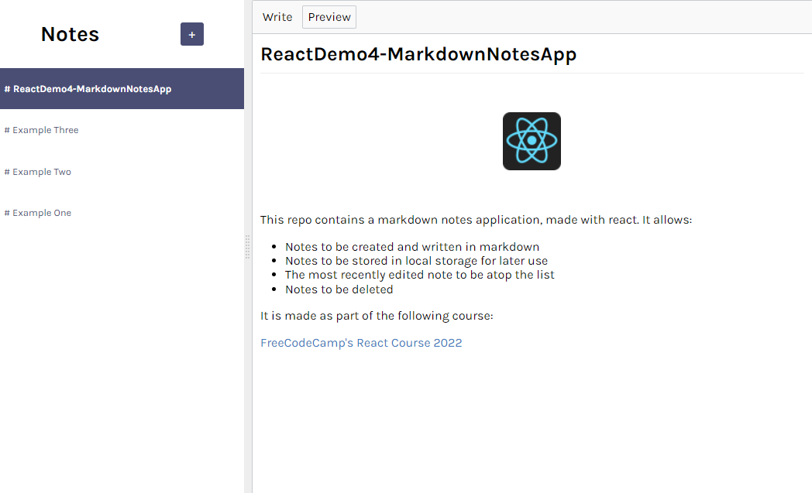

# ReactDemo4-MarkdownNotesApp

 

 

This repo contains a markdown notes application, made with react. It allows:
- Notes to be created and written in markdown
- Notes to be stored in local storage for later use
- The most recently edited note to be atop the list
- Notes to be deleted

It is made as part of the following course:

[FreeCodeCamp's React Course 2022](https://www.youtube.com/watch?v=bMknfKXIFA8&list=WL&index=1)
